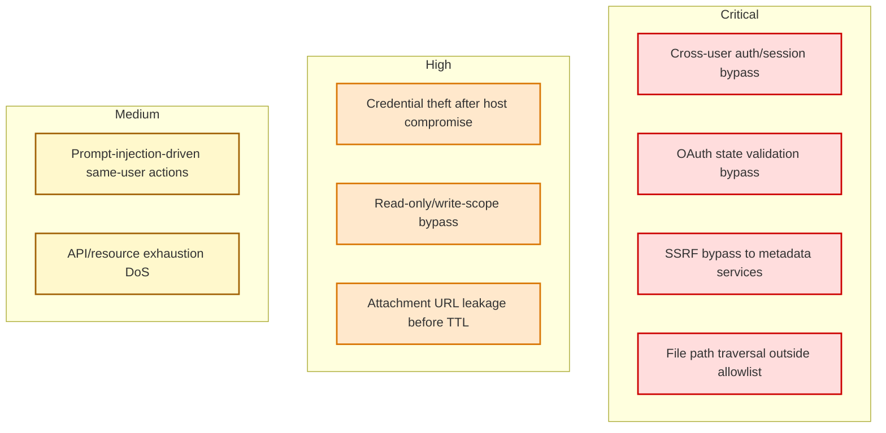

# Google Workspace MCP — Pictorial Threat Model

This document converts the narrative threat model into diagrams (data-flow and attack paths) so engineering and security reviews can quickly identify trust boundaries, attack surfaces, and mitigations.

## 1) System context diagram

```mermaid
flowchart LR
    subgraph ClientSide[Client / Caller Side]
      A1[MCP Client / AI Assistant\n(JSON-RPC / HTTP Caller)]
      A2[Attacker-Controlled Inputs\n- tool params\n- headers\n- callback params\n- document/email prompt content]
    end

    subgraph ServerHost[Google Workspace MCP Server Host]
      B1[FastMCP Server\ncore/server.py\nfastmcp_server.py]
      B2[Auth Middleware & Binding\nauth/auth_info_middleware.py\nauth/service_decorator.py]
      B3[OAuth 2.1 Session Store\nauth/oauth21_session_store.py]
      B4[Credential Store\nauth/credential_store.py]
      B5[Attachment Storage\ncore/attachment_storage.py]
      B6[Path Validation\ncore/utils.validate_file_path]
      B7[URL Fetch + SSRF Guards\ngdrive/drive_tools.py]
      B8[Tool Registry & Scope Enforcement\ncore/tool_registry.py\nauth/permissions.py]
    end

    subgraph External[External Dependencies]
      C1[Google OAuth + Google APIs]
      C2[External URLs\n(user-supplied fileUrl)]
      C3[Local Filesystem\ncredentials + attachments + uploads]
      C4[Logs/Observability]
    end

    A1 -->|JSON-RPC / HTTP| B1
    A2 -->|Untrusted input reaches| B1
    B1 --> B2
    B2 --> B3
    B2 --> B4
    B1 --> B8
    B1 --> B5
    B1 --> B6
    B1 --> B7

    B2 <--> |OAuth tokens / userinfo| C1
    B8 <--> |Scoped API operations| C1
    B4 <--> C3
    B5 <--> C3
    B6 <--> C3
    B7 -->|HTTP fetch (guarded)| C2
    B1 --> C4
```

## 2) Trust boundaries (DFD-style)

```mermaid
flowchart TB
    U[Untrusted / Semi-trusted Inputs\n(Client params, headers, callback query, URL content)]
    T1{{Boundary 1:\nMCP Client <-> Server}}
    S[Workspace MCP Server Process]

    T2{{Boundary 2:\nServer <-> Google APIs}}
    G[Google OAuth + Google Workspace APIs]

    T3{{Boundary 3:\nServer <-> Local Filesystem}}
    F[Credential files, attachments, uploads]

    T4{{Boundary 4:\nServer <-> External URLs}}
    X[Internet hosts / file URLs]

    O[Operator-controlled Config\n(env vars, tool tiers, backend settings)]

    U --> T1 --> S
    S --> T2 --> G
    S --> T3 --> F
    S --> T4 --> X
    O --> S
```

## 3) High-risk attack paths and defenses

```mermaid
flowchart TD
    A[Attacker Goal: Access/abuse protected data or actions] --> B1[Cross-user data access]
    A --> B2[Token theft / credential compromise]
    A --> B3[SSRF to internal metadata/services]
    A --> B4[Local file exfiltration]
    A --> B5[Unsafe high-impact tool execution]
    A --> B6[Attachment leakage]

    B1 --> M1[Supply forged user_google_email]
    M1 --> D1[Mitigation: OAuth2.1 session binding +\nemail override in service_decorator]

    B2 --> M2[Read plaintext credential files or sensitive logs]
    M2 --> D2[Mitigation: host hardening, secret hygiene,\noptional encrypted OAuth2.1 session storage]

    B3 --> M3[Use fileUrl targeting 169.254.169.254 / RFC1918]
    M3 --> D3[Mitigation: DNS resolve + global IP checks +\nredirect validation + IP pinning]

    B4 --> M4[Provide path outside allowlist / secret dirs]
    M4 --> D4[Mitigation: validate_file_path allowlist +\nblocklist for common secret locations]

    B5 --> M5[Exploit missing scope metadata/read-only bypass]
    M5 --> D5[Mitigation: require scope decorators +\ntool registry permission filtering]

    B6 --> M6[Obtain unauthed attachment URL]
    M6 --> D6[Mitigation: entropy + short TTL (1h) +\nlog/prompt discipline; residual risk remains]
```

## 4) STRIDE-style control map

```mermaid
flowchart LR
    S[Spoofing\n- forged identity/email] --> C1[Session-bound credentials\n+ verified token/userinfo checks]
    T[Tampering\n- state/callback/session misuse] --> C2[Single-use OAuth state\n+ validated callback flow]
    R[Repudiation\n- action ambiguity] --> C3[Operational logging\n(sensitive handling required)]
    I[Information Disclosure\n- tokens/files/attachments] --> C4[Path restrictions + TTL attachments\n+ secure storage posture]
    D[Denial of Service\n- large fetch/API abuse] --> C5[Size limits (2GB URL fetch)\n+ recommended rate limits (operational)]
    E[Elevation of Privilege\n- write actions via weak scope controls] --> C6[Scope-based tool filtering\n+ tiered permissions]
```

## 5) Criticality heatmap



## 6) Security review checklist tied to the model

- **Auth/session isolation**: verify no code path accepts caller-provided identity in OAuth 2.1 mode.
- **Scope gating**: ensure every new tool has explicit required scopes and is picked up by permission filters.
- **Filesystem boundary**: validate all local file operations pass `validate_file_path` allowlist logic.
- **External fetch safety**: preserve SSRF controls (DNS/IP checks, redirect checks, pinned destination).
- **Attachment confidentiality**: evaluate whether unauthenticated attachment routes need signed/authenticated access in hosted environments.
- **Operational controls**: enforce least-privilege scopes, rate limiting, secure logging, and secrets-at-rest hardening.

---

If useful, this can be rendered directly on GitHub (Mermaid supported) and exported as images for design/security reviews.
