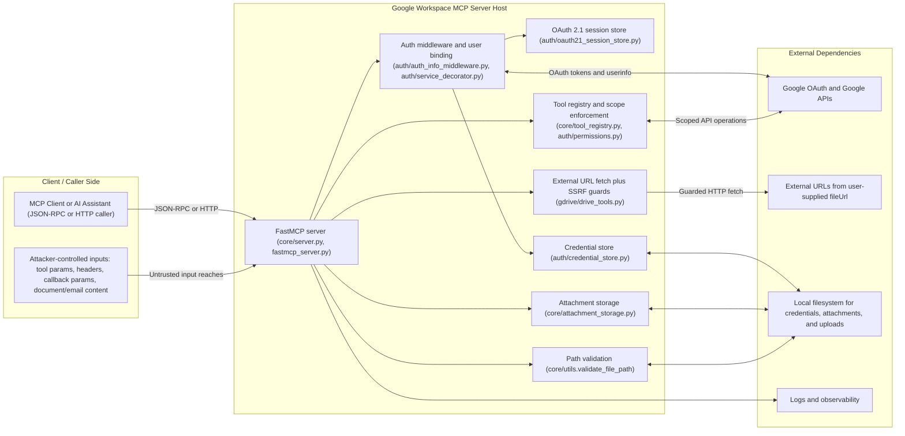
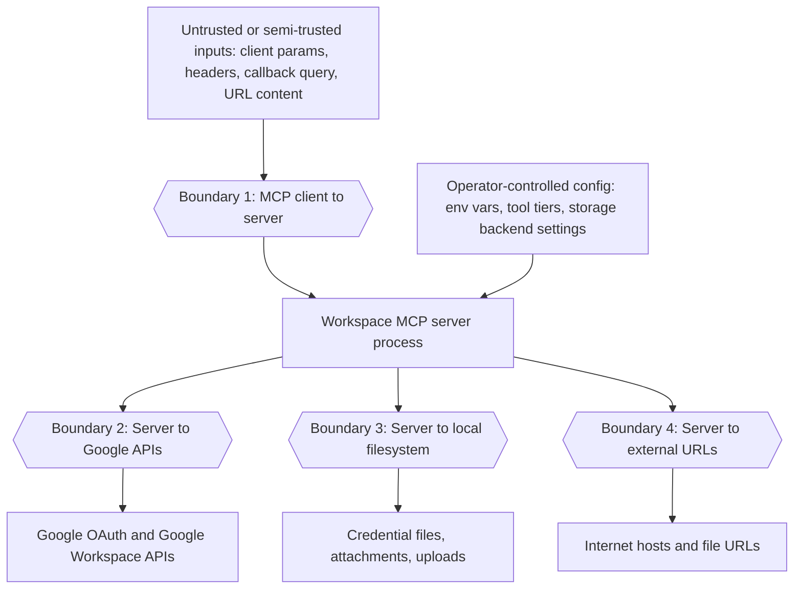
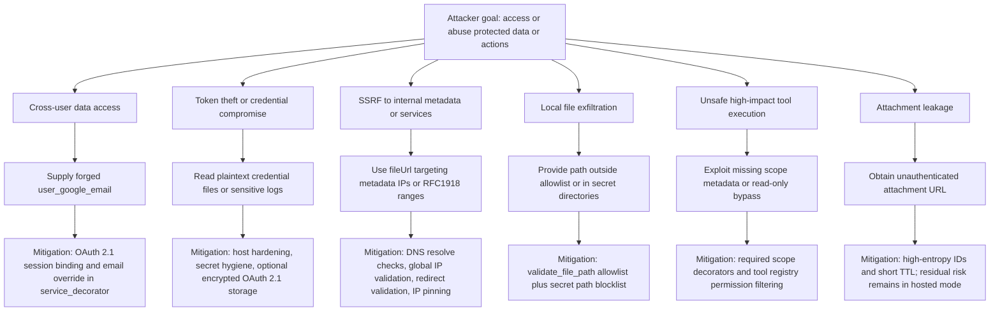
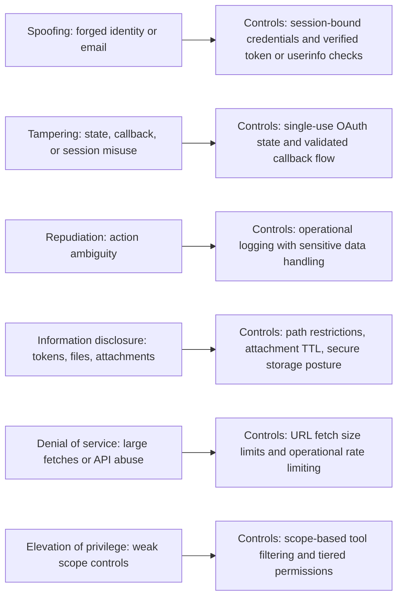
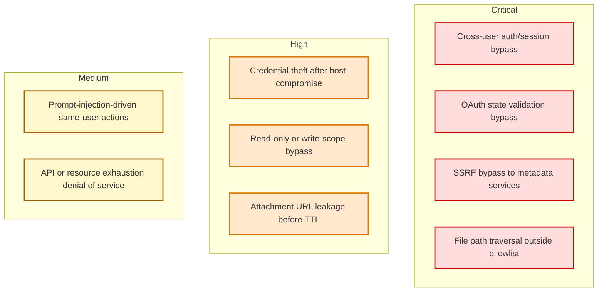

# Google Workspace MCP — Pictorial Threat Model

This document converts the narrative threat model into diagrams so engineering and security reviews can quickly identify trust boundaries, attack surfaces, and mitigations.

## 1) System context diagram

## 2) Trust boundaries (DFD-style)

## 3) High-risk attack paths and defenses

## 4) STRIDE-style control map

## 5) Criticality heatmap

## 6) Security review checklist tied to the model

- **Auth/session isolation**: verify no code path accepts caller-provided identity in OAuth 2.1 mode.
- **Scope gating**: ensure every new tool has explicit required scopes and is picked up by permission filters.
- **Filesystem boundary**: validate all local file operations pass `validate_file_path` allowlist logic.
- **External fetch safety**: preserve SSRF controls (DNS and IP checks, redirect checks, pinned destination).
- **Attachment confidentiality**: evaluate whether unauthenticated attachment routes need signed or authenticated access in hosted environments.
- **Operational controls**: enforce least-privilege scopes, rate limiting, secure logging, and secrets-at-rest hardening.
