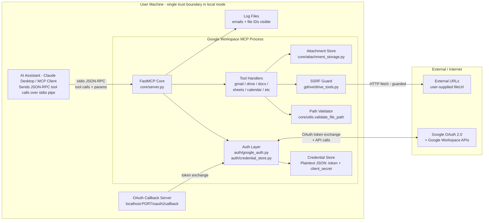
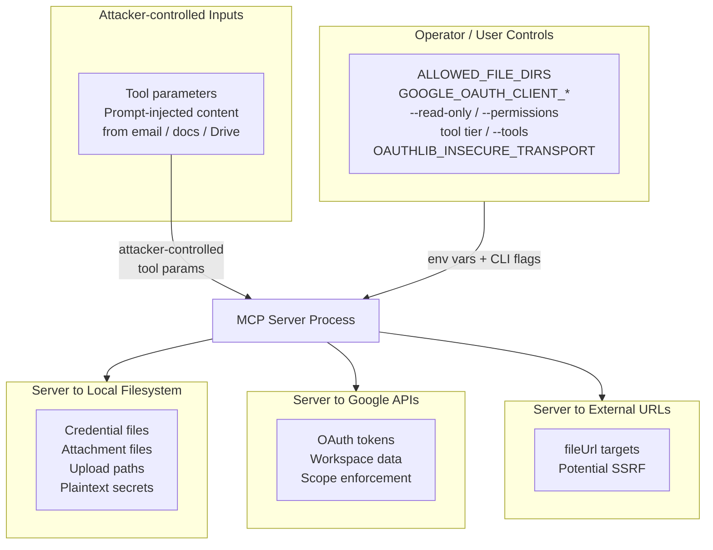
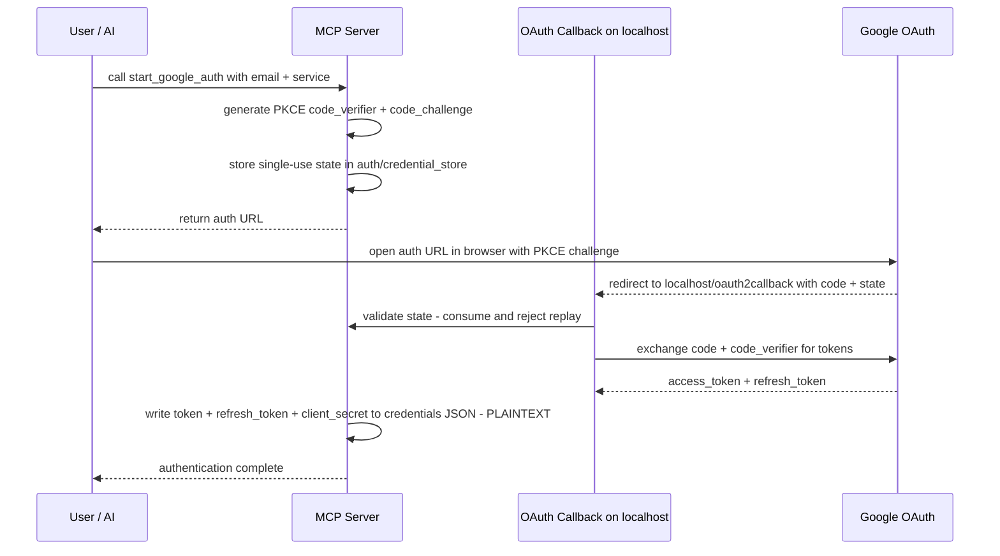
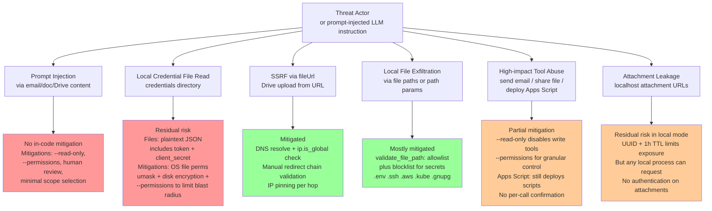
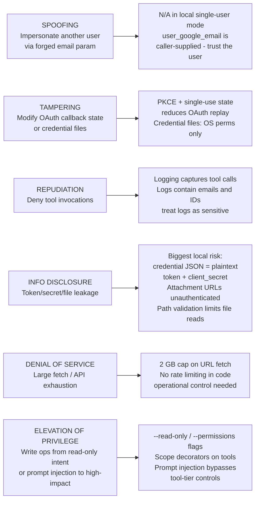
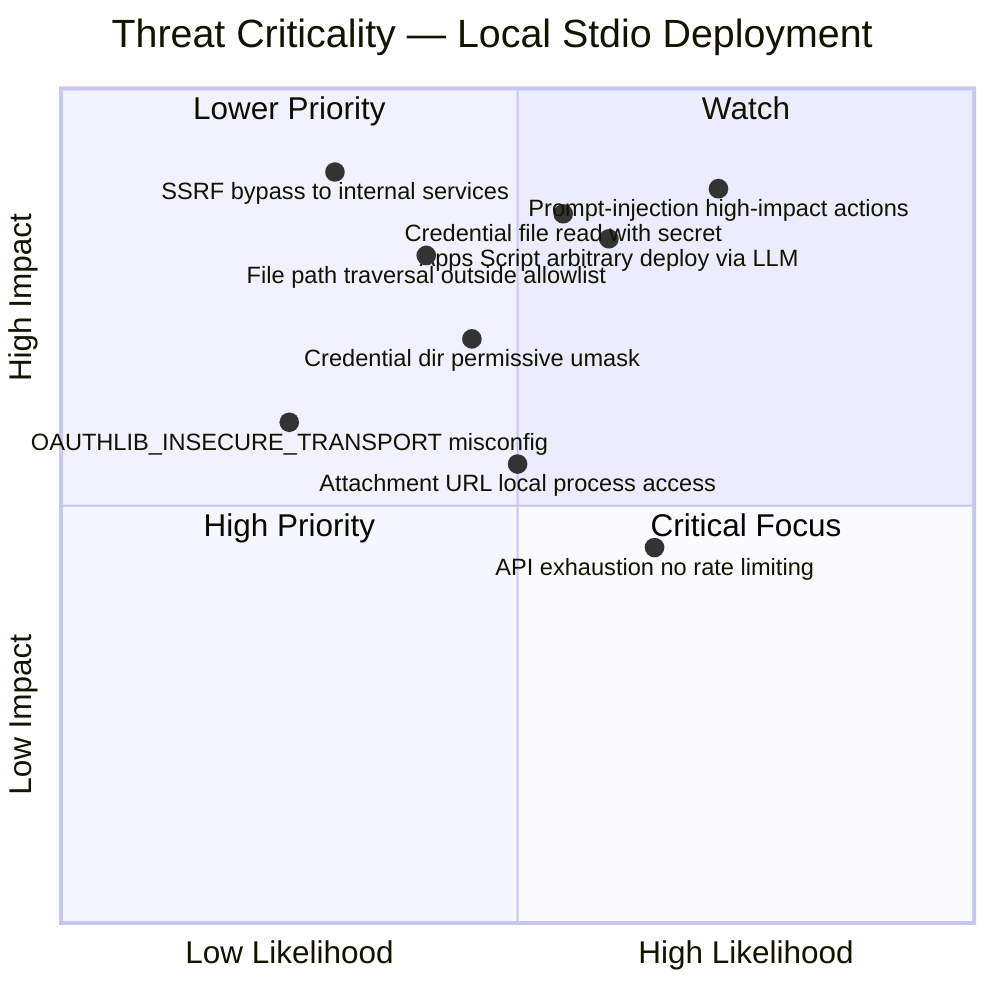
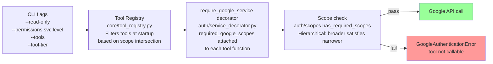

# Google Workspace MCP — Threat Model - Local/Stdio Mode

> **Deployment scope:** This model is scoped to **local per-user stdio/CLI deployment** (the default `--transport stdio` mode). Hosted / proxy / OAuth 2.1 multi-user concerns are noted where they differ but are not the primary focus.

---

## 1. System context — Local / Stdio mode

---

## 2. Trust boundaries - DFD style

### 2a. Overview

### Trust boundary table

| ID | Trust Boundary | From | To | What Crosses |
|---|---|---|---|---|
| **TB1** | MCP Client ↔ Server | AI Assistant / MCP Client | MCP Server Process via stdio pipe | JSON-RPC tool calls, tool parameters, prompt-injected content from email/docs/Drive |
| **TB2** | Server ↔ Local Filesystem | MCP Server Process | Host filesystem | Credential files, attachment files, upload file paths, plaintext secrets |
| **TB3** | Server ↔ Google APIs | MCP Server Process | Google OAuth 2.0 + Workspace APIs | OAuth tokens, API requests, Workspace data, scope enforcement |
| **TB4** | Server ↔ External URLs | MCP Server Process | User-supplied URL targets | HTTP/HTTPS fetch for Drive file import via fileUrl parameter |
| **TB5** | Operator Configuration ↔ Server | Environment variables, `.env`, CLI flags | MCP Server Process | `ALLOWED_FILE_DIRS`, `GOOGLE_OAUTH_CLIENT_*`, `--read-only`, `--permissions`, `--tools`, `--tool-tier`, `OAUTHLIB_INSECURE_TRANSPORT` |

---

## 3. Data flow — Authentication - local OAuth 2.0 flow

---

## 4. Attack paths and defenses — Local mode focus

---

## 5. STRIDE control map — Local deployment

---

## 6. Threat criticality — Local mode

---

## 7. Scope gating architecture

---

---

*Diagrams are Mermaid-compatible and render natively on GitHub and VS Code. Last verified against commit history March 2026.*

---

## 8. Consolidated threat catalog

> **Risk scoring methodology**
>
> Each threat is scored on two axes using a **1–5 scale**:
>
> | Score | Impact | Likelihood |
> |---|---|---|
> | **5** | Critical — Full account takeover, arbitrary code execution, mass data breach | Almost certain — Trivial to exploit, no control in place, attacker-reachable |
> | **4** | High — Credential theft, significant data exfiltration, unauthorized write actions | Likely — Low barrier, common attack pattern, weak or partial control |
> | **3** | Medium — Limited data exposure, partial privilege escalation, service disruption | Possible — Requires specific conditions, moderate skill, or configuration gap |
> | **2** | Low — Minor information disclosure, limited DoS, metadata leakage | Unlikely — Requires local access + additional compromise, or unlikely conditions |
> | **1** | Negligible — Cosmetic, non-exploitable, or defense-in-depth gap only | Rare — Requires chained exploits, nation-state capability, or theoretical only |
>
> **Risk = Impact × Likelihood** (scale 1–25)
>
> | Risk Score | Rating |
> |---|---|
> | **20–25** | Critical |
> | **12–19** | High |
> | **6–11** | Medium |
> | **1–5** | Low |

| # | ID | Threat Title | Boundary | STRIDE | Description | Impact | Likelihood | Risk | Rating |
|---|---|---|---|---|---|---|---|---|---|
| 1 | TB1-S1 | Fake user_google_email parameter | TB1 | S | The server trusts the caller-supplied user_google_email on every tool call to load credentials. In stdio mode there is no server-side identity verification — any string is accepted. | 4 | 3 | 12 | High |
| 2 | TB1-S2 | Arbitrary email recipients via to/cc/bcc | TB1 | S | send_gmail_message accepts any recipient addresses with no allowlisting. A compromised or prompt-injected LLM can direct email to attacker-controlled recipients. | 4 | 4 | 16 | High |
| 3 | TB1-S3 | Send-as alias abuse via from_email | TB1 | S | from_email parameter lets the caller choose any Gmail send-as alias. If privileged aliases exist, the LLM can impersonate higher-authority senders. | 3 | 3 | 9 | Medium |
| 4 | TB1-S4 | Resource ID forgery | TB1 | S | All tools accept file_id, folder_id, document_id, spreadsheet_id, script_id, calendar_id, space_id as opaque strings. The server cannot verify the LLM discovered the ID legitimately versus from injected content. | 3 | 3 | 9 | Medium |
| 5 | TB1-S5 | Spoofed tool call origin on stdio pipe | TB1 | S | The stdio pipe carries no caller authentication. Any local process that can write to the pipe can inject tool calls indistinguishable from the legitimate MCP client. | 3 | 2 | 6 | Medium |
| 6 | TB1-S6 | Calendar invite impersonation | TB1 | S | create_calendar_event can send invitations to arbitrary attendees appearing to come from the authenticated user. A prompt-injected LLM can mass-invite or send fake meeting requests. | 3 | 3 | 9 | Medium |
| 7 | TB1-S7 | Chat message impersonation | TB1 | S | send_chat_message posts to Google Chat spaces as the authenticated user. Injected instructions can make the LLM post misleading messages that appear to come from the user. | 3 | 3 | 9 | Medium |
| 8 | TB1-T1 | Prompt injection via email content | TB1 | T | Email bodies returned by read tools are passed raw to the LLM. Attacker-crafted emails can embed instructions that hijack subsequent tool calls. No sanitization or filtering. | 5 | 5 | 25 | Critical |
| 9 | TB1-T2 | Prompt injection via document/sheet/slide content | TB1 | T | Docs, Sheets cell values, and Slides text are returned unfiltered. Shared documents can carry payloads that alter LLM behavior. | 5 | 4 | 20 | Critical |
| 10 | TB1-T3 | Prompt injection via Drive file names and metadata | TB1 | T | File names, descriptions, and comments returned in search results can contain instruction-like text that the LLM may interpret as directives. | 4 | 3 | 12 | High |
| 11 | TB1-T4 | Prompt injection via calendar event descriptions | TB1 | T | Event titles, descriptions, locations, and attendee notes returned by calendar read tools can carry injected instructions. | 4 | 3 | 12 | High |
| 12 | TB1-T5 | Prompt injection via contact notes/fields | TB1 | T | Contact records returned by list_contacts include free-text fields like notes, job titles, and organization names that can embed injected instructions. | 3 | 2 | 6 | Medium |
| 13 | TB1-T6 | Prompt injection via chat message history | TB1 | T | get_chat_messages returns message text from other users in a space. A malicious participant can plant injection payloads in the conversation history. | 4 | 3 | 12 | High |
| 14 | TB1-T7 | Path traversal via file:// URLs | TB1 | T | create_drive_file accepts fileUrl with file:// scheme. Any file under ALLOWED_FILE_DIRS that is not on the blocklist can be read and uploaded to Drive. | 4 | 3 | 12 | High |
| 15 | TB1-T9 | Formula injection in Sheets | TB1 | T | modify_sheet_values defaults to USER_ENTERED mode enabling formula evaluation. Injected formulas can exfiltrate data or trigger external requests when the sheet is opened. | 3 | 3 | 9 | Medium |
| 16 | TB1-T11 | Multi-step destructive tool call chains | TB1 | T | An attacker who can influence the LLM can orchestrate a sequence of tool calls where each looks benign but the chain is destructive — e.g. search, share, then delete. | 4 | 4 | 16 | High |
| 17 | TB1-T12 | Email draft modification before send | TB1 | T | LLM creates a draft then sends it. Between creation and send, the LLM could be manipulated to alter the body. The user has no confirmation gate. | 3 | 2 | 6 | Medium |
| 18 | TB1-T13 | JSON-RPC message tampering on stdio | TB1 | T | The stdio pipe is an unencrypted local stream. Any process with access to the pipe's file descriptors can inject or modify JSON-RPC messages in transit. | 3 | 1 | 3 | Low |
| 19 | TB1-R1 | Spoofed identity in audit logs | TB1 | R | Tool calls log the client-supplied user_google_email without validation. A forged email makes it impossible to attribute actions to the real caller. | 4 | 3 | 12 | High |
| 20 | TB1-R2 | No cryptographic proof of tool invocations | TB1 | R | The server does not sign or hash requests/responses. There is no tamper-proof audit trail tying a Google API action back to a specific MCP client request. | 3 | 3 | 9 | Medium |
| 21 | TB1-R3 | No cross-tool correlation ID | TB1 | R | No request ID links a chain of tool calls originating from the same LLM prompt. A malicious multi-step attack cannot be reconstructed from logs. | 3 | 3 | 9 | Medium |
| 22 | TB1-R4 | LLM-initiated vs user-initiated indistinguishable | TB1 | R | Logs cannot differentiate between an action the user explicitly asked for and one the LLM decided to take autonomously or due to prompt injection. There is no intent signal recorded. | 4 | 4 | 16 | High |
| 23 | TB1-R6 | Insufficient granularity in logged parameters | TB1 | R | Logs may record that send_gmail_message was called but not the full body/to/bcc — or conversely log too much PII. Either extreme hinders forensic investigation. | 2 | 3 | 6 | Medium |
| 24 | TB1-I1 | Unfiltered email content returned to LLM | TB1 | I | Full email bodies, headers, and attachment metadata are returned. PII, credentials, confidential business data, and legal-privileged content are exposed to the LLM context window and potentially the LLM provider. | 5 | 5 | 25 | Critical |
| 25 | TB1-I2 | Full Apps Script source code disclosure | TB1 | I | get_script_project returns complete source. Scripts often contain hardcoded API keys, DB credentials, internal URLs, or proprietary business logic. | 4 | 3 | 12 | High |
| 26 | TB1-I3 | Spreadsheet data leakage to LLM | TB1 | I | read_sheet_values returns all cells in a range. HR spreadsheets, financial models, salary data, and customer lists can be exposed to the LLM. | 4 | 4 | 16 | High |
| 27 | TB1-I4 | Contact PII bulk extraction | TB1 | I | list_contacts returns emails, phone numbers, addresses, organizations for all contacts. This enables bulk PII harvesting via a single tool call. | 3 | 3 | 9 | Medium |
| 28 | TB1-I5 | Drive file metadata and shareable links | TB1 | I | search_drive_files returns webViewLink, webContentLink, file IDs, names, sizes, and ownership. An attacker can map the user's entire Drive structure. | 3 | 3 | 9 | Medium |
| 29 | TB1-I6 | Calendar data leakage | TB1 | I | Calendar events expose meeting titles, attendee lists, locations, conference links, and private notes — potentially revealing M&A activities, hiring plans, or confidential meetings. | 3 | 3 | 9 | Medium |
| 30 | TB1-I7 | Chat conversation history leakage | TB1 | I | get_chat_messages returns full message history from Google Chat spaces. Confidential team discussions, shared links, and internal decisions are exposed. | 3 | 3 | 9 | Medium |
| 31 | TB1-I8 | Data exfiltration via tool chaining | TB1 | I | A prompt-injected LLM can read sensitive data via one tool and exfiltrate it via another — e.g. read an email, then send the content to an external address, or read a file then upload it to an attacker-shared Drive folder. | 5 | 4 | 20 | Critical |
| 32 | TB1-I9 | Sensitive data in error responses | TB1 | I | Error messages may include file names, IDs, MIME types, internal paths, or stack traces that reveal environment information. | 2 | 3 | 6 | Medium |
| 33 | TB1-I10 | Data leakage to LLM provider | TB1 | I | All tool responses traverse the LLM context. In cloud-hosted LLM scenarios, sensitive Workspace data leaves the organization's control and enters the LLM provider's infrastructure. | 4 | 4 | 16 | High |
| 34 | TB1-I11 | Search query leakage reveals user intent | TB1 | I | search_drive_files, search_gmail query strings logged or sent to the LLM reveal what the user is looking for — potentially sensitive in legal, HR, or M&A contexts. | 2 | 2 | 4 | Low |
| 35 | TB1-D2 | Large file download memory exhaustion | TB1 | D | get_drive_file_content downloads up to 2GB into memory with no per-request timeout. A single call targeting a large file blocks the server process. | 3 | 3 | 9 | Medium |
| 36 | TB1-D3 | Batch operation memory exhaustion | TB1 | D | get_gmail_messages_content_batch has no hard cap on total messages per request. Hundreds of message IDs can exhaust process memory. | 3 | 2 | 6 | Medium |
| 37 | TB1-D4 | Zip bomb via Office file extraction | TB1 | D | extract_office_xml_text unzips Office files without validating decompressed size. A crafted .docx can expand to exhaust memory during text extraction. | 3 | 2 | 6 | Medium |
| 38 | TB1-D5 | Unbounded parameter length | TB1 | D | Text parameters like body, content, text have no MCP-layer length validation. Extremely large payloads consume memory before reaching Google APIs. | 2 | 2 | 4 | Low |
| 39 | TB1-D6 | Recursive or looping tool call sequences | TB1 | D | A prompt-injected LLM could be made to call tools in an infinite loop — repeatedly searching, reading, and forwarding emails — exhausting API quotas and local resources. | 3 | 3 | 9 | Medium |
| 40 | TB1-D7 | Server crash via malformed JSON-RPC | TB1 | D | Malformed or unexpected JSON-RPC messages on the stdio pipe could cause unhandled exceptions, crashing the server process. | 2 | 2 | 4 | Low |
| 41 | TB1-D8 | Google account lockout via auth abuse | TB1 | D | Repeated calls to start_google_auth with invalid parameters could trigger Google's abuse detection, temporarily locking the user's OAuth access. | 2 | 1 | 2 | Low |
| 42 | TB1-E1 | Prompt injection escalating read to write | TB1 | E | Email/doc/sheet content instructs the LLM to call write tools. Passive read intent escalates to active write — sending email, sharing files, deleting content — via injected instructions. | 5 | 5 | 25 | Critical |
| 43 | TB1-E2 | Arbitrary code execution via Apps Script chain | TB1 | E | update_script_content + manage_deployment + run_script_function allows injecting and executing arbitrary server-side code with the user's full Workspace permissions. This is remote code execution. | 5 | 3 | 15 | High |
| 44 | TB1-E4 | Cross-service privilege escalation | TB1 | E | A tool call in one service grants capabilities in another — e.g. reading a Drive file ID from an email, then sharing the file externally. The LLM bridges services in ways the user may not anticipate. | 4 | 4 | 16 | High |
| 45 | TB1-E5 | Admin impersonation via send-as aliases | TB1 | E | LLM sends email as admin@company.com or ceo@company.com if configured as a Gmail alias, impersonating a higher-privilege identity to external and internal recipients. | 3 | 2 | 6 | Medium |
| 46 | TB1-E6 | Tool discovery and enumeration | TB1 | E | The MCP protocol exposes the full list of available tools and their parameter schemas to the client. An attacker or injected prompt can enumerate all capabilities before choosing a target action. | 2 | 4 | 8 | Medium |
| 47 | TB1-E7 | Delegation chain abuse — persistent backdoor sharing | TB1 | E | The LLM can share a document with a broader audience than the user intended, or add permissions that create a persistent backdoor — e.g. sharing a folder with anyone_with_link. | 4 | 3 | 12 | High |
| 48 | TB1-E8 | Data staging for external access | TB1 | E | Rather than directly exfiltrating data, the LLM can stage it for later retrieval — copying sensitive content into a new public Google Doc, creating a publicly-shared Drive file, or forwarding emails to a drop account. | 4 | 3 | 12 | High |
| 49 | TB1-E9 | No human-in-the-loop for destructive actions | TB1 | E | High-impact operations like send_gmail_message, manage_drive_access, delete_drive_file, manage_deployment execute immediately without a confirmation step. The MCP server has no concept of "are you sure?" | 4 | 4 | 16 | High |
| 50 | TB2-S1 | Credential file replacement | TB2 | S | A local attacker replaces credentials JSON with tokens for a different Google account. The server loads whatever is on disk without integrity verification — all subsequent API calls operate under the attacker's account. | 5 | 2 | 10 | Medium |
| 51 | TB2-S2 | Symlink substitution for credential files | TB2 | S | Attacker replaces the credentials directory or individual JSON file with a symlink to an attacker-controlled location. The server follows the symlink and loads forged credentials. | 4 | 2 | 8 | Medium |
| 52 | TB2-S4 | Attachment file replacement on disk | TB2 | S | Between creation and download, an attacker replaces an attachment file on disk with different content. The /attachments/ route serves whatever file is at the path without integrity checks. | 3 | 2 | 6 | Medium |
| 53 | TB2-S5 | Temp file injection during download | TB2 | S | During streaming downloads, the server writes to NamedTemporaryFile in the system temp directory. A local attacker could race to replace the temp file content before it is uploaded to Drive. | 2 | 1 | 2 | Low |
| 54 | TB2-T1 | Credential file tampering — no integrity check | TB2 | T | A local attacker modifies token values, scopes, or client_secret in a credential JSON file. The server has no checksum or signature verification — tampered values are used directly for Google API calls. | 5 | 2 | 10 | Medium |
| 55 | TB2-T2 | TOCTOU race on file path validation | TB2 | T | validate_file_path resolves symlinks at check time, but between validation and actual file read, the target can be swapped via symlink manipulation. The file that was validated is not the file that is read. | 4 | 2 | 8 | Medium |
| 56 | TB2-T3 | Log file tampering or deletion | TB2 | T | Log files are written with default umask permissions and have no integrity protection. A local attacker can modify or delete log entries to erase evidence of malicious actions. | 4 | 2 | 8 | Medium |
| 57 | TB2-T4 | Attachment content tampering on disk | TB2 | T | Attachment files stored under ~/.workspace-mcp/attachments/ can be modified between save and serve. The file is served as-is with no hash verification against original content. | 3 | 2 | 6 | Medium |
| 58 | TB2-T6 | Credential directory permission downgrade | TB2 | T | A local attacker changes permissions on the credentials directory to world-readable after initial creation. The server does not re-check directory permissions at runtime. | 3 | 2 | 6 | Medium |
| 59 | TB2-T7 | File content swap during upload | TB2 | T | When create_drive_file reads a local file for upload, the file content can be swapped between the validate_file_path check and the actual read_bytes call. | 3 | 2 | 6 | Medium |
| 60 | TB2-T8 | Temp directory poisoning | TB2 | T | Temp files for streaming downloads are created in /tmp with default umask. Other local users can monitor, read, or replace content in temp files before they are uploaded to Drive. | 3 | 2 | 6 | Medium |
| 61 | TB2-R1 | Log file deletion or truncation | TB2 | R | Log files have no append-only or immutable protection. A local attacker or the server process itself can delete or truncate mcp_server_debug.log, destroying the audit trail. | 4 | 2 | 8 | Medium |
| 62 | TB2-R2 | No integrity chain for credential operations | TB2 | R | The server does not log a hash or fingerprint when it reads or writes credential files. If credentials are tampered with, there is no way to detect when the tampering occurred. | 3 | 3 | 9 | Medium |
| 63 | TB2-R3 | Attachment access not logged | TB2 | R | The /attachments/ route does not log who accessed the file, from what IP, or when. Downloaded attachments leave no audit trail. | 3 | 3 | 9 | Medium |
| 64 | TB2-R4 | Credential file creation not attributable | TB2 | R | store_credential writes credential files but does not record which MCP client session or tool invocation triggered the write. Multiple auth flows cannot be distinguished in forensic analysis. | 2 | 3 | 6 | Medium |
| 65 | TB2-I1 | Plaintext credentials readable by local users | TB2 | I | Credential files contain access_token, refresh_token, and client_secret in plaintext JSON. Directory permissions depend on umask — on permissive systems these files may be world-readable or group-readable. | 5 | 3 | 15 | High |
| 66 | TB2-I2 | Predictable credential file naming | TB2 | I | Credential files are named {user_email}.json. An attacker who knows the user's email can directly target the correct file without searching. | 4 | 4 | 16 | High |
| 67 | TB2-I3 | Client secret co-located with tokens | TB2 | I | store_credential writes the OAuth client_secret into the same JSON file as tokens. A single file read exposes both the application secret and the user's refresh token — enough to independently mint new access tokens. | 5 | 3 | 15 | High |
| 68 | TB2-I4 | Attachment files accessible without authentication | TB2 | I | The /attachments/ route requires only knowledge of the UUID file ID. Any local process, browser script, or network peer on localhost can download attachments. | 4 | 3 | 12 | High |
| 69 | TB2-I5 | Sensitive data in log files | TB2 | I | mcp_server_debug.log contains credential directory paths, file paths, authorization codes during OAuth, user emails, and file IDs. Log file permissions are not hardened. | 4 | 3 | 12 | High |
| 70 | TB2-I6 | Temp files expose sensitive content | TB2 | I | NamedTemporaryFile in /tmp stores downloaded content with default umask permissions. Other local users can read these files. | 3 | 2 | 6 | Medium |
| 71 | TB2-I8 | Attachment metadata leakage via file naming | TB2 | I | Attachment files are stored with original filenames. Directory listing reveals email attachment names, document titles, and file types — metadata that may itself be sensitive. | 2 | 3 | 6 | Medium |
| 72 | TB2-I9 | Credential file residue after overwrite | TB2 | I | When credentials are refreshed, old files are overwritten but not securely wiped. File system journaling or undelete tools could recover previous tokens. | 3 | 2 | 6 | Medium |
| 73 | TB2-I10 | Attachment routes exposed on localhost without auth | TB2 | I | In stdio mode, the OAuth callback server binds to localhost and serves /attachments/ without auth. Any local process or malware can enumerate and download attachments during the 1-hour TTL window. | 4 | 3 | 12 | High |
| 74 | TB2-D1 | Disk exhaustion via attachment accumulation | TB2 | D | Attachments have a 1-hour TTL but cleanup is only triggered on access or manual invocation — no background cleanup process. Rapid attachment creation can fill disk. | 3 | 2 | 6 | Medium |
| 75 | TB2-D2 | Credential directory permission failure blocks server | TB2 | D | If the credentials directory becomes unwritable, all auth flows fail. The server has no graceful degradation for filesystem permission errors. | 3 | 2 | 6 | Medium |
| 76 | TB2-D3 | Log file disk exhaustion — no rotation | TB2 | D | Debug logging writes verbose output to mcp_server_debug.log with no log rotation or size cap. Long-running sessions can produce multi-gigabyte logs. | 3 | 3 | 9 | Medium |
| 77 | TB2-D4 | Large local file read exhausts memory | TB2 | D | create_drive_file with a file:// URL reads the entire file into memory via read_bytes. There is no size limit for local file reads — a multi-GB file exhausts process memory. | 3 | 2 | 6 | Medium |
| 78 | TB2-D5 | Temp directory exhaustion | TB2 | D | Streaming downloads to /tmp with a 2GB cap per file can exhaust temp space if multiple concurrent downloads occur or cleanup fails. | 2 | 1 | 2 | Low |
| 79 | TB2-D6 | Attachment file locking race | TB2 | D | No file locking on attachment files. Concurrent read/write by the cleanup process and the serve route could cause partial reads or serve errors. | 2 | 1 | 2 | Low |
| 80 | TB2-E1 | Credential file theft enables full account takeover | TB2 | E | Reading a credential file gives the attacker refresh_token + client_secret — sufficient to independently generate new access tokens and call Google APIs. This is a full offline account takeover. | 5 | 3 | 15 | High |
| 81 | TB2-E3 | Blocklist bypass via novel sensitive paths | TB2 | E | The blocklist in validate_file_path is a hardcoded list of known sensitive paths. Application-specific secrets, database files, browser cookie DBs, or newly-installed tool configs not on the list are readable. | 4 | 3 | 12 | High |
| 82 | TB2-E4 | Local file exfiltration via Drive upload | TB2 | E | An attacker who can influence tool calls via prompt injection can use create_drive_file with file:// URLs to upload local files to Drive, then share them externally. The filesystem becomes an exfiltration source. | 4 | 3 | 12 | High |
| 83 | TB2-E5 | Symlink escape from ALLOWED_FILE_DIRS | TB2 | E | If a symlink within an allowed directory points outside it, validate_file_path resolves the symlink. A race condition allows swapping a valid symlink target to a disallowed path between resolution and read. | 3 | 2 | 6 | Medium |
| 84 | TB2-E6 | Attachment route as unauthenticated data channel | TB2 | E | The /attachments/ route can be abused as an unauthenticated data exfiltration endpoint. If the LLM saves sensitive data as an attachment, any local process can retrieve it without credentials. | 3 | 2 | 6 | Medium |
| 85 | TB2-E7 | Filesystem access escalates to Google API access | TB2 | E | A local attacker who gains read access to credential files can independently call Google APIs with the user's full granted scopes — escalating from local filesystem access to cloud-level access. | 5 | 3 | 15 | High |
| 86 | TB3-S2 | Stolen refresh token used from external machine | TB3 | S | Refresh tokens stored on disk have no device binding. If exfiltrated, an attacker can use them from any machine to mint access tokens. Google cannot distinguish legitimate from stolen usage. | 5 | 3 | 15 | High |
| 87 | TB3-S3 | OAuth callback port hijacking on localhost | TB3 | S | In stdio mode, the OAuth callback server binds to a dynamic localhost port. A malicious local process could race to bind the same port or intercept the callback, capturing the authorization code. | 4 | 2 | 8 | Medium |
| 88 | TB3-S5 | ID token decoded without signature verification | TB3 | S | google_auth.py decodes ID tokens with verify_signature=False. While the token comes from Google's OAuth flow, a forged ID token from a tampered disk file could mislead email extraction. | 2 | 1 | 2 | Low |
| 89 | TB3-S6 | MITM via compromised system CA store | TB3 | S | The server uses the system CA bundle for TLS with no certificate pinning. A compromised CA or corporate MITM proxy can intercept Google API traffic including OAuth tokens and Workspace data. | 4 | 1 | 4 | Low |
| 90 | TB3-T1 | Drive API query injection | TB3 | T | search_drive_files escapes only single quotes in free-text queries. Structured query patterns bypass escaping entirely. An attacker can inject Drive API operators to broaden search results. | 3 | 3 | 9 | Medium |
| 91 | TB3-T2 | Unvalidated batch payloads sent to Google APIs | TB3 | T | batch_update_doc, Slides batch operations, and Apps Script updates forward raw request dictionaries to Google APIs without schema validation. Malicious payloads can cause data destruction. | 4 | 3 | 12 | High |
| 92 | TB3-T3 | Malicious content uploaded to Drive via API | TB3 | T | Files uploaded via create_drive_file have no content inspection. Malware, phishing documents, or policy-violating content can be uploaded, potentially triggering organizational compliance violations. | 3 | 3 | 9 | Medium |
| 93 | TB3-T4 | Token refresh returns different scopes silently | TB3 | T | When Google rotates tokens, the new token may have different scopes. The server stores whatever Google returns without comparing against the originally-granted scope set. | 2 | 1 | 2 | Low |
| 94 | TB3-T5 | API request parameter injection | TB3 | T | Tool parameters flow directly into Google API request bodies and query strings with minimal sanitization. Specially crafted parameters could modify API behavior beyond intent. | 3 | 2 | 6 | Medium |
| 95 | TB3-T6 | Proxy interception of API traffic | TB3 | T | If HTTP_PROXY or HTTPS_PROXY environment variables are set, all Google API traffic routes through the proxy. A malicious proxy can modify requests and responses in transit. | 4 | 1 | 4 | Low |
| 96 | TB3-R1 | Google API actions not locally audited in detail | TB3 | R | The MCP server logs only tool-level calls, not the full API request/response. If Google's audit logs are unavailable, there is no local record of exactly what was sent to the API. | 3 | 3 | 9 | Medium |
| 97 | TB3-R2 | Token refresh events not audited | TB3 | R | Token refresh operations are logged at debug level but not in a structured audit format. An attacker using a stolen refresh token generates no distinguishable local audit event. | 3 | 3 | 9 | Medium |
| 98 | TB3-R3 | Scope changes between sessions not tracked | TB3 | R | If a user re-authenticates with different scopes, the credential file is overwritten. There is no history of previous scope grants, making it impossible to determine when scope escalation occurred. | 2 | 2 | 4 | Low |
| 99 | TB3-I1 | OAuth tokens over plaintext HTTP on localhost | TB3 | I | When OAUTHLIB_INSECURE_TRANSPORT=1 is active, access tokens and refresh tokens are sent over unencrypted HTTP during the OAuth callback. Any local process sniffing localhost traffic can capture them. | 4 | 3 | 12 | High |
| 100 | TB3-I2 | Full API error details returned to LLM | TB3 | I | Google API error responses including HTTP status codes, error messages, and sometimes internal resource paths are returned to the LLM. This aids reconnaissance of the user's Workspace configuration. | 2 | 4 | 8 | Medium |
| 101 | TB3-I4 | Token leakage via HTTP logs | TB3 | I | Despite log suppression for httpx/httpcore, access tokens could appear in error stack traces, debug logs, or third-party library logs if log levels are changed. | 4 | 2 | 8 | Medium |
| 102 | TB3-I5 | Third-party PII in API responses exposed to LLM | TB3 | I | API responses include data created by other users — email sender addresses, document collaborator names, calendar attendee details. This third-party PII is exposed to the LLM without those individuals' consent. | 3 | 4 | 12 | High |
| 103 | TB3-I6 | Client secret exposed in token requests | TB3 | I | The OAuth client_secret is sent to Google's token endpoint in every token exchange and refresh. If the transport is compromised, the application-level secret is exposed alongside user tokens. | 4 | 2 | 8 | Medium |
| 104 | TB3-D1 | Google API rate limit exhaustion | TB3 | D | No rate limiting before API calls. Rapid tool invocations can trigger Google's rate limits, resulting in 429 errors that block all API access for a period. | 3 | 4 | 12 | High |
| 105 | TB3-D2 | Token refresh storm on concurrent calls | TB3 | D | If multiple concurrent tool calls detect an expired token simultaneously, each may independently attempt a refresh, causing redundant requests and race conditions in credential storage. | 3 | 2 | 6 | Medium |
| 106 | TB3-D3 | Exponential backoff amplification | TB3 | D | The retry logic uses exponential backoff on SSL errors. An attacker who can induce repeated SSL failures forces increasingly long waits, blocking API calls. | 2 | 1 | 2 | Low |
| 107 | TB3-D4 | Google account suspension via abuse detection | TB3 | D | Extremely high API call volumes or unusual patterns could trigger Google's abuse detection, leading to temporary or permanent suspension of the user's API access. | 4 | 2 | 8 | Medium |
| 108 | TB3-E1 | Scope hierarchy broader than intended | TB3 | E | The hardcoded scope hierarchy maps broad scopes to narrow ones. If the hierarchy is incorrect or outdated relative to Google's actual scope model, a tool may operate with more permissions than expected. | 3 | 2 | 6 | Medium |
| 109 | TB3-E2 | Stale scope hierarchy enables privilege creep | TB3 | E | The scope hierarchy is manually maintained. If Google introduces new scopes or changes relationships, the server's hierarchy becomes outdated and may inadvertently grant access to new capabilities. | 3 | 2 | 6 | Medium |
| 110 | TB3-E3 | Full-scope token used for minimal operations | TB3 | E | A token granted gmail.modify scope is used for both read and write operations. There is no mechanism to request a read-only token for read operations and a write token only when needed. | 4 | 4 | 16 | High |
| 111 | TB3-E4 | Apps Script runs with user's full Workspace permissions | TB3 | E | Scripts executed via run_script_function run with the authenticated user's full Google Workspace permissions, which may exceed the scopes granted to the MCP server's OAuth token. | 5 | 3 | 15 | High |
| 112 | TB3-E5 | Cross-service access via single OAuth session | TB3 | E | A single OAuth session with broad scopes allows tool calls across Gmail, Drive, Calendar, Contacts, Chat, and Apps Script. Compromising one tool's parameters gives access to all services. | 4 | 4 | 16 | High |
| 113 | TB4-S1 | MITM on HTTP URL fetch | TB4 | S | The fileUrl parameter accepts http:// URLs. Fetching over plain HTTP allows any network-level attacker to intercept and replace the response content, which is then uploaded to Drive. | 4 | 2 | 8 | Medium |
| 114 | TB4-S2 | DNS spoofing to redirect fetch target | TB4 | S | If the local DNS resolver is compromised, hostname resolution for the fileUrl target can be redirected. IP pinning validates is_global but cannot detect a poisoned DNS returning a different public IP. | 3 | 2 | 6 | Medium |
| 115 | TB4-S3 | Content-Type header spoofing by malicious server | TB4 | S | The external server controls the Content-Type response header. The MCP server trusts it to set the MIME type on the uploaded Drive file. A malicious server can cause file misinterpretation. | 3 | 3 | 9 | Medium |
| 116 | TB4-S4 | TLS certificate spoofing via compromised CA | TB4 | S | HTTPS URL fetches rely on the system CA store. A compromised CA or corporate MITM proxy can present valid certificates for arbitrary hostnames, allowing content substitution. | 3 | 1 | 3 | Low |
| 117 | TB4-T1 | Malicious content injection into Google Drive | TB4 | T | An attacker-controlled URL serves malicious content that gets uploaded to Drive — phishing documents, malware, or files that exploit Drive preview/rendering vulnerabilities. | 4 | 3 | 12 | High |
| 118 | TB4-T2 | Redirect chain to probe internal infrastructure | TB4 | T | Despite per-hop SSRF validation, a 10-hop redirect chain can amplify requests, probe multiple internal hostnames, and observe timing differences to fingerprint internal infrastructure. | 3 | 2 | 6 | Medium |
| 119 | TB4-T3 | DNS rebinding between validation and fetch | TB4 | T | Although IP pinning mitigates classic DNS rebinding, a TOCTOU window exists with TTL=0 DNS responses combined with redirects to the same hostname potentially re-resolving on the next hop. | 3 | 1 | 3 | Low |
| 120 | TB4-T4 | Response size manipulation for resource exhaustion | TB4 | T | A malicious server can send data up to the 2GB limit before being cut off. Slow-dripping data ties up the server process and consumes disk or memory. | 3 | 3 | 9 | Medium |
| 121 | TB4-T5 | Chunked transfer encoding abuse — slowloris | TB4 | T | A malicious server using chunked encoding can send indefinite small chunks. No explicit timeout is configured on the httpx client, allowing slowloris-style resource exhaustion. | 3 | 3 | 9 | Medium |
| 122 | TB4-R1 | Fetched URL not recorded with uploaded file | TB4 | R | When content from an external URL is uploaded to Drive, the original source URL is not stored as file metadata. There is no audit trail linking a Drive file to its external source. | 3 | 4 | 12 | High |
| 123 | TB4-R2 | Redirect chain not logged | TB4 | R | The full redirect chain traversed during URL fetch is not logged. If the final content comes from a different domain than the original URL, this intermediate path is lost. | 2 | 4 | 8 | Medium |
| 124 | TB4-I1 | SSRF to internal/cloud metadata services | TB4 | I | If SSRF protections are bypassed, the server could fetch cloud metadata endpoints exposing IAM credentials and cloud configuration. Strong IP validation mitigates this but a bypass would be critical. | 5 | 1 | 5 | Low |
| 125 | TB4-I2 | Server fingerprinting via fetch behavior | TB4 | I | The external server observes the MCP server's User-Agent, TLS fingerprint, IP address, request timing, and redirect-following behavior, revealing technology stack and network location. | 2 | 4 | 8 | Medium |
| 126 | TB4-I3 | Internal hostname enumeration via DNS errors | TB4 | I | By supplying internal hostnames as fileUrl targets, an attacker can observe whether DNS resolution succeeds or fails, enumerating internal network hosts from error messages. | 3 | 2 | 6 | Medium |
| 127 | TB4-I4 | Timing side-channel on IP validation | TB4 | I | The difference in response time between blocked IPs, resolvable public IPs, and non-resolvable hostnames reveals whether internal hostnames exist in DNS, even when the fetch is blocked. | 2 | 1 | 2 | Low |
| 128 | TB4-I5 | Fetched content visible to LLM — indirect injection | TB4 | I | Content downloaded from external URLs and uploaded to Drive may subsequently be read by the LLM via Drive tools. Malicious content designed for prompt injection can enter the LLM context indirectly. | 4 | 3 | 12 | High |
| 129 | TB4-D1 | Slowloris / slow-read attack — no timeout | TB4 | D | No explicit timeout configured on httpx clients for URL fetching. A malicious server sending data extremely slowly can hold the connection open indefinitely, blocking the server process. | 3 | 3 | 9 | Medium |
| 130 | TB4-D2 | 2GB download resource exhaustion | TB4 | D | The 2GB download limit allows a single URL fetch to consume up to 2GB of memory or temp disk space, potentially exhausting server resources. | 3 | 2 | 6 | Medium |
| 131 | TB4-D3 | Redirect amplification with slow servers | TB4 | D | A 10-hop redirect chain, each to a slow-responding server, multiplies fetch latency by 10x. Combined with no timeout, this can block the server for extended periods. | 3 | 2 | 6 | Medium |
| 132 | TB4-D4 | DNS resolution amplification | TB4 | D | Each redirect hop triggers a fresh DNS resolution. An attacker can craft a chain where each hop requires resolving a different hostname, generating amplified DNS query volume. | 2 | 1 | 2 | Low |
| 133 | TB4-D5 | Connection pool exhaustion | TB4 | D | If multiple concurrent fileUrl fetches are triggered by rapid tool calls, the httpx connection pool can be exhausted, blocking all outbound HTTP requests including Google API calls. | 3 | 2 | 6 | Medium |
| 134 | TB4-E1 | SSRF bypass to access cloud metadata | TB4 | E | A novel SSRF bypass technique could allow fetching cloud metadata endpoints, exposing IAM credentials that provide broader cloud access than the MCP server's own permissions. | 5 | 1 | 5 | Low |
| 135 | TB4-E2 | External content becomes trusted Drive content | TB4 | E | Content fetched from an untrusted external URL is uploaded to Drive and subsequently treated as trusted Workspace content. Other tools do not distinguish between user-created and externally-sourced files. | 4 | 3 | 12 | High |
| 136 | TB4-E4 | Fetched content triggers prompt injection via Drive | TB4 | E | An attacker hosts a document containing prompt injection payloads. Content is uploaded to Drive via fileUrl, then read by the LLM via get_drive_file_content. The injection crosses from TB4 to TB1. | 4 | 3 | 12 | High |
| 137 | TB5-S1 | .env file replacement by local attacker | TB5 | S | The server loads .env from a hardcoded project-relative path. A local attacker who can write to the deployment directory can replace .env to inject arbitrary OAuth credentials or configuration. | 4 | 2 | 8 | Medium |
| 138 | TB5-S2 | Environment variable injection on shared hosting | TB5 | S | On shared hosting or multi-user systems, environment variables may be visible or writable by other users. An attacker who sets GOOGLE_OAUTH_CLIENT_ID/SECRET redirects all OAuth flows through their app. | 4 | 2 | 8 | Medium |
| 139 | TB5-S3 | Forged WORKSPACE_EXTERNAL_URL | TB5 | S | If an attacker sets WORKSPACE_EXTERNAL_URL to their domain, the server advertises the attacker's URL as the OAuth callback endpoint, redirecting token exchange to the attacker. | 5 | 2 | 10 | Medium |
| 140 | TB5-S4 | Redirect URI injection via GOOGLE_OAUTH_REDIRECT_URI | TB5 | S | The GOOGLE_OAUTH_REDIRECT_URI environment variable is used without scheme or domain validation. Setting it to an attacker URL redirects OAuth tokens to the attacker's server. | 5 | 2 | 10 | Medium |
| 141 | TB5-S5 | Custom redirect URI injection via OAUTH_CUSTOM_REDIRECT_URIS | TB5 | S | This comma-separated list of URIs is parsed without validation. Injecting attacker-controlled URIs adds them to the allowed redirect list, enabling OAuth token theft. | 4 | 2 | 8 | Medium |
| 142 | TB5-T1 | ALLOWED_FILE_DIRS=/ disables file restrictions | TB5 | T | Setting ALLOWED_FILE_DIRS=/ makes every file on the system accessible via validate_file_path. The server does not warn or reject overly broad path configurations. | 5 | 2 | 10 | Medium |
| 143 | TB5-T2 | OAUTHLIB_INSECURE_TRANSPORT auto-mutation | TB5 | T | The server silently sets OAUTHLIB_INSECURE_TRANSPORT=1 on localhost. This environment mutation happens without explicit operator consent and enables plaintext OAuth. | 4 | 4 | 16 | High |
| 144 | TB5-T3 | tool_tiers.yaml tampering | TB5 | T | The tool tier configuration is loaded from a hardcoded YAML file. A local attacker who can write to the deployment directory can modify tier definitions to expose all tools. | 4 | 2 | 8 | Medium |
| 145 | TB5-T4 | WORKSPACE_MCP_CREDENTIALS_DIR redirect | TB5 | T | Setting this variable to a world-readable or attacker-controlled directory redirects all credential storage there. The server creates the directory without permission validation. | 4 | 2 | 8 | Medium |
| 146 | TB5-T5 | OAUTHLIB_RELAX_TOKEN_SCOPE silently downgrades | TB5 | T | The server auto-sets this variable, which silently accepts reduced scope grants from Google. An attacker who controls the consent screen can grant fewer scopes, and the server continues without error. | 3 | 3 | 9 | Medium |
| 147 | TB5-T6 | CLI argument injection via --cli remainder | TB5 | T | The --cli flag uses nargs=REMAINDER, accepting any subsequent arguments without validation. If the CLI handler does not properly validate these, injection into internal operations is possible. | 3 | 2 | 6 | Medium |
| 148 | TB5-R1 | No startup configuration audit log | TB5 | R | The server's effective configuration is partially displayed at startup but not written to a structured audit log. There is no tamper-proof record of what configuration was active during a security event. | 3 | 3 | 9 | Medium |
| 149 | TB5-R2 | Environment mutation not logged as security event | TB5 | R | Auto-setting OAUTHLIB_INSECURE_TRANSPORT and OAUTHLIB_RELAX_TOKEN_SCOPE is logged at warning/info level but not flagged as a security-relevant configuration change. | 2 | 4 | 8 | Medium |
| 150 | TB5-R3 | Configuration drift between restarts not tracked | TB5 | R | If an operator changes .env or CLI flags between server restarts, there is no diff or history. Configuration drift is undetectable from server logs alone. | 2 | 2 | 4 | Low |
| 151 | TB5-I1 | OAuth client secret readable from .env | TB5 | I | The .env file contains GOOGLE_OAUTH_CLIENT_SECRET in plaintext. File permissions depend on the deployment environment — on shared systems the secret may be world-readable. | 4 | 3 | 12 | High |
| 152 | TB5-I2 | Startup config display reveals sensitive paths | TB5 | I | The server prints credential directory paths, OAuth configuration, and enabled tools at startup. If logs are captured by a shared logging system, sensitive paths are exposed. | 2 | 3 | 6 | Medium |
| 153 | TB5-I4 | ALLOWED_FILE_DIRS not shown in startup config | TB5 | I | The effective file access allowlist is not shown in the startup configuration summary. Operators cannot verify the server's actual file access scope without reading code or environment directly. | 3 | 3 | 9 | Medium |
| 154 | TB5-I5 | Default credential directory path is predictable | TB5 | I | The default credential path ~/.google_workspace_mcp/credentials/ is well-known. Any attacker who knows this MCP server is installed can target this specific directory for credential theft. | 3 | 4 | 12 | High |
| 155 | TB5-D1 | Invalid PORT or HOST crashes server | TB5 | D | Port and host values from environment variables are not validated for range or format. Invalid values cause unhandled exceptions during socket binding, crashing the server. | 2 | 2 | 4 | Low |
| 156 | TB5-D2 | Missing OAuth credentials cause silent failures | TB5 | D | If GOOGLE_OAUTH_CLIENT_ID or GOOGLE_OAUTH_CLIENT_SECRET are not set, the server starts but all auth flows fail at runtime with unclear error messages. | 3 | 3 | 9 | Medium |
| 157 | TB5-D3 | Mismatched client ID/secret cause runtime failures | TB5 | D | If the client ID and secret are from different Google projects, the server starts but token exchange fails. The error only appears when a user attempts to authenticate. | 2 | 2 | 4 | Low |
| 158 | TB5-D4 | Conflicting config flags not validated | TB5 | D | Some config conflicts are caught, but others like --read-only with --permissions gmail:send are not validated for logical consistency. | 2 | 2 | 4 | Low |
| 159 | TB5-E1 | Default-open — all tools enabled | TB5 | E | Without --tools, --tool-tier, or --permissions, all 12 tool modules are registered with full read/write/delete/deploy capabilities. The default is maximum privilege. | 4 | 4 | 16 | High |
| 160 | TB5-E2 | Default full scopes — no least-privilege | TB5 | E | Without --read-only or --permissions, the server requests the broadest OAuth scopes for each service. The token can do more than any single user task requires. | 4 | 4 | 16 | High |
| 161 | TB5-E3 | OAuth 2.0 default lacks modern security | TB5 | E | OAuth 2.1 with mandatory PKCE S256 is disabled by default. The default OAuth 2.0 mode allows plain PKCE method and has weaker security guarantees. | 3 | 3 | 9 | Medium |
| 162 | TB5-E4 | ALLOWED_FILE_DIRS defaults to entire home directory | TB5 | E | Without explicit configuration, the file allowlist covers ~ which includes browser profiles, application data, personal documents, and other sensitive files not on the blocklist. | 3 | 3 | 9 | Medium |
| 163 | TB5-E5 | Tool tier YAML not operator-configurable | TB5 | E | The tool tier definitions are hardcoded in the deployment. An operator cannot customize which tools belong to which tier without modifying source code. No integrity verification on the YAML. | 3 | 2 | 6 | Medium |
| 164 | TB5-E6 | OAUTH_ALLOWED_ORIGINS not validated | TB5 | E | CORS origin values from this environment variable are not validated as proper origins. Setting wildcard or attacker origins could enable cross-origin access to the MCP server in HTTP mode. | 3 | 2 | 6 | Medium |

### Top 10 threats by risk score

| Rank | # | ID | Threat | Boundary | Risk | Rating |
|---|---|---|---|---|---|---|
| 1 | 8 | TB1-T1 | Prompt injection via email content | TB1 | 25 | Critical |
| 2 | 24 | TB1-I1 | Unfiltered email content returned to LLM | TB1 | 25 | Critical |
| 3 | 42 | TB1-E1 | Prompt injection escalating read to write | TB1 | 25 | Critical |
| 4 | 9 | TB1-T2 | Prompt injection via document/sheet/slide content | TB1 | 20 | Critical |
| 5 | 31 | TB1-I8 | Data exfiltration via tool chaining | TB1 | 20 | Critical |
| 6 | 2 | TB1-S2 | Arbitrary email recipients via to/cc/bcc | TB1 | 16 | High |
| 7 | 16 | TB1-T11 | Multi-step destructive tool call chains | TB1 | 16 | High |
| 8 | 22 | TB1-R4 | LLM-initiated vs user-initiated indistinguishable | TB1 | 16 | High |
| 9 | 26 | TB1-I3 | Spreadsheet data leakage to LLM | TB1 | 16 | High |
| 10 | 33 | TB1-I10 | Data leakage to LLM provider | TB1 | 16 | High |

---

## 9. Mitigation catalog

> Each mitigation is mapped to the threat(s) it addresses. **Status** indicates whether the control is already present in the codebase (`Implemented`, `Partially Implemented`) or recommended as a new control (`Proposed`).

| Mitigation ID | Description | Applies To | Status | Severity |
|---|---|---|---|---|
| M-01 | **Granular permission system** — `--permissions` CLI flag enables per-service permission levels (readonly, organize, send, full, etc.) via `auth/permissions.py`. Cumulative scope model restricts tools to declared level. `--read-only` flag restricts all services to readonly scopes. | TB1-S2, TB1-S3, TB1-S6, TB1-S7, TB1-E7, TB1-E8, TB1-E9, TB1-T11, TB1-T12, TB1-E1, TB1-E2, TB1-E4, TB1-E5, TB5-E1, TB5-E2, TB3-E3, TB3-E5, TB3-E4 | Implemented | Critical |
| M-02 | **Multi-stage tool filtering at startup** — `core/tool_registry.py` applies tier filtering (`--tool-tier`), explicit tool selection (`--tools`), OAuth 2.1 filtering, read-only mode filtering, and granular permissions filtering. Tools not satisfying ALL required scopes are removed before any client interaction. | TB1-E6, TB5-E1, TB5-E5, TB1-E2, TB1-E4, TB1-E9 | Implemented | High |
| M-03 | **Scope-checked service decorator** — `auth/service_decorator.py` `require_google_service` decorator validates that the authenticated credential has the required scopes (via `has_required_scopes`) before every Google API call. Hierarchical scope model in `auth/scopes.py` ensures broader scopes satisfy narrower requirements. | TB3-E1, TB3-E2, TB3-E3, TB5-E2 | Implemented | Medium |
| M-04 | **OAuth 2.1 identity binding** — In OAuth 2.1 mode, `service_decorator.py` validates that the access token email matches the authenticated session context AND the requested user_google_email. Mismatches raise `GoogleAuthenticationError`. `_override_oauth21_user_email()` enforces session-bound identity. | TB1-S1 | Partially Implemented — OAuth 2.1 mode only; no equivalent control in default OAuth 2.0 stdio mode | High |
| M-05 | **PKCE with single-use state** — `auth/google_auth.py` generates PKCE code_verifier for OAuth flows and 16-byte cryptographically random state tokens (`os.urandom(16).hex()`). State is consumed on first use via `validate_and_consume_oauth_state()`, preventing replay attacks. | TB3-S3, TB3-S5, TB5-E3 | Partially Implemented — PKCE S256 only enforced in OAuth 2.1; OAuth 2.0 allows `plain` method | Medium |
| M-06 | **File path validation sandbox** — `core/utils.py` `validate_file_path()` applies: (1) symlink resolution via `Path.resolve()`, (2) blocklist of 13+ sensitive filenames (.env, credentials.json, .npmrc, etc.), (3) system path blocklist (/proc, /sys, /dev, /etc/shadow), (4) credential directory blocklist (.ssh, .aws, .kube, .gnupg, .config/gcloud), (5) allowlist check against `ALLOWED_FILE_DIRS` or home directory. | TB1-T7, TB2-E3, TB2-E4, TB2-E5, TB2-D4, TB2-I1 | Implemented | High |
| M-07 | **SSRF protection suite** — `gdrive/drive_tools.py` implements: (1) DNS resolution with `socket.getaddrinfo()`, (2) `ipaddress.is_global` IP validation blocking private/link-local/loopback, (3) explicit localhost variant blocking, (4) manual redirect chain validation (max 10 hops) with per-hop re-validation, (5) IP pinning to prevent DNS rebinding, (6) scheme whitelist (http/https only), (7) SNI hostname pinning. | TB4-S1, TB4-S2, TB4-T2, TB4-T3, TB4-I1, TB4-I3, TB4-E1, TB4-D3, TB4-D4 | Implemented | High |
| M-08 | **Download size limit** — `gdrive/drive_tools.py` enforces `MAX_DOWNLOAD_BYTES = 2GB` for URL fetches and streaming downloads, with per-chunk byte counting. | TB4-T4, TB4-D2, TB1-D2, TB4-D1, TB4-D5 | Implemented | Medium |
| M-09 | **Attachment storage hardening** — `core/attachment_storage.py` applies: directory permissions `0o700`, file permissions `0o600`, UUID4 file IDs, 1-hour TTL with expiration check before serving, cleanup of expired files on access. | TB2-S4, TB2-T4, TB2-I8, TB2-D1, TB2-D6 | Implemented | Medium |
| M-10 | **HTTP log suppression** — `main.py` sets httpx and httpcore loggers to WARNING level, preventing access tokens from appearing in HTTP request/response logs. | TB3-I4, TB3-I6 | Implemented | Medium |
| M-11 | **Email header injection prevention** — `gmail/gmail_tools.py` strips CR (`\r`), LF (`\n`), and NUL (`\x00`) characters from display names and attachment filenames in `_prepare_gmail_message()`. | TB1-S2, TB1-S3 | Partially Implemented — sanitizes headers but does not restrict recipient addresses | Medium |
| M-12 | **HTML content safety** — `gmail/gmail_tools.py` uses stdlib `HTMLParser` to extract text, blocks `<script>` and `<style>` tags, truncates HTML bodies at 20KB (`HTML_BODY_TRUNCATE_LIMIT`). | TB1-T1, TB1-I1 | Partially Implemented — reduces injection surface but does not sanitize prompt-injection payloads in text | Critical |
| M-13 | **XXE prevention** — `core/utils.py` uses `defusedxml.ElementTree` for Office XML file extraction, preventing XML External Entity attacks. | TB1-D4 | Implemented | Medium |
| M-14 | **Safe YAML loading** — `core/tool_tier_loader.py` uses `yaml.safe_load()` to parse tool tier configuration, preventing arbitrary code execution via YAML deserialization. | TB5-T3 | Partially Implemented — prevents code execution but no integrity verification (hash/signature) on the YAML file | Medium |
| M-15 | **Fernet-encrypted token storage** — `core/server.py` `FernetEncryptionWrapper` encrypts OAuth tokens at rest using a key derived from the JWT signing key. Applied to disk-based OAuth 2.1 session storage. | TB2-I1, TB2-I3, TB2-E1, TB2-E7, TB2-T1 | Partially Implemented — OAuth 2.1 mode only; OAuth 2.0 credentials stored in plaintext JSON | High |
| M-16 | **Startup configuration display** — `main.py` prints version, transport mode, Python version, enabled tools, OAuth mode, and key configuration at startup via `safe_print()`. | TB5-R1, TB5-I4 | Partially Implemented — informational display only, not written as structured audit log | Low |
| M-17 | **CLI flag mutual exclusion validation** — `main.py` validates that `--permissions` and `--read-only` are mutually exclusive, and `--permissions` and `--tools` are mutually exclusive. Also validates OAuth 2.1 configuration consistency. | TB5-D4 | Partially Implemented — catches some conflicts but not all (e.g., `--read-only` with `--permissions gmail:send`) | Low |
| M-18 | **Credential directory permission check** — `core/utils.py` `check_credentials_directory_permissions()` tests write access to the credentials directory at startup and exits if the check fails. | TB2-D2, TB2-T6 | Partially Implemented — verifies write access only; does not enforce restrictive permissions like `chmod 700` | Medium |
| M-19 | **Drive API query escaping** — `gdrive/drive_tools.py` escapes single quotes in user-supplied search queries before passing them to the Drive API. | TB3-T1 | Partially Implemented — only escapes single quotes; structured query operators bypass escaping | Medium |
| M-20 | **Drive share role/type whitelists** — `gdrive/drive_helpers.py` validates share roles and types against explicit whitelists (`VALID_SHARE_ROLES`, `VALID_SHARE_TYPES`) and validates expiration time format. | TB1-E7 | Partially Implemented — validates role/type choices but does not restrict who can be shared with | Medium |
| M-21 | **Calendar input validation** — `gcalendar/calendar_tools.py` enforces: max 5 reminders, method whitelist (popup/email), minutes range 0-40320, transparency whitelist, visibility whitelist, RFC3339 time format validation, guest permission boolean controls. | TB1-S6 | Partially Implemented — validates event parameters but does not restrict attendee addresses | Low |
| M-22 | **Sheets input validation** — `gsheets/sheets_tools.py` validates value types (List[List[str]]), detects Sheets error tokens (#VALUE!, #REF!, etc.), validates number format types against whitelist, validates color/alignment/wrap parameters. | TB1-T9, TB1-I3 | Partially Implemented — validates structure but `USER_ENTERED` mode still allows formula evaluation | High |
| M-23 | **Docs batch operation validation** — `gdocs/managers/batch_operation_manager.py` validates each operation type, index ranges, and parameters. `validation_manager.py` enforces table dimension limits (1000 rows, 20 cols), color validation, URL scheme whitelist (http/https), and paragraph style whitelists. Recursion depth limit of 5 in `extract_text_from_elements()`. | TB3-T2, TB3-T5 | Partially Implemented — validates structure and parameters but does not perform full schema validation against Google API specs | High |
| M-24 | **Apps Script version management** — `gappsscript/apps_script_tools.py` creates a versioned snapshot before deployment. Action whitelist validates allowed deployment actions (create/update/delete) with required parameter checks per action. | TB1-E2 | Partially Implemented — provides deployment controls but does not restrict script content or sandbox execution | Medium |
| M-25 | **Chat resource bounds** — `gchat/chat_tools.py` bounds sender cache at 256 entries with LRU eviction, limits search to first 10 spaces with 5 results each, truncates messages at 100 chars for display, validates attachment index bounds. | TB1-I7, TB1-S7 | Partially Implemented — limits resource usage but does not filter prompt-injection content from messages | Medium |
| M-26 | **Email basic format validation** — `auth/google_auth.py` checks `user_google_email` contains `@` before proceeding with authentication. User enumeration prevention in credential store excludes non-credential files. | TB1-S1 | Partially Implemented — basic format check only; no identity binding in stdio mode | High |
| M-27 | **SSL error retry with backoff** — `core/utils.py` retries Google API calls on SSL errors with exponential backoff (`2^attempt`). Context-aware 401/403 error messages guide reauthentication. | TB3-D3, TB3-D2 | Implemented | Medium |
| M-28 | **Proposed: Recipient allowlisting for outbound email** — Implement an operator-configurable allowlist of permitted recipient domains/addresses for `send_gmail_message`. Reject or flag attempts to email addresses outside the allowlist. | TB1-S2, TB1-S6, TB1-I8, TB1-E1, TB1-E8 | Proposed | Critical |
| M-29 | **Proposed: Human-in-the-loop confirmation for high-impact operations** — Implement an MCP-layer confirmation step for destructive or sensitive tool calls: `send_gmail_message`, `manage_drive_access`, `delete_drive_file`, `manage_deployment`, `run_script_function`, `create_calendar_event` (with external attendees). Return a confirmation prompt requiring explicit user approval before execution. | TB1-E9, TB1-E1, TB1-E2, TB1-T11, TB1-T12, TB1-E7, TB1-E8, TB1-S2, TB1-S6, TB1-S7, TB1-I8, TB1-E4, TB1-E5, TB1-D6 | Proposed | Critical |
| M-30 | **Proposed: Tool response content filtering** — Apply prompt-injection–aware sanitization to all tool responses before returning them to the LLM. Options include: instruction boundary markers, content length limits per response, stripping known injection patterns, or content tagging to distinguish data from instructions. | TB1-T1, TB1-T2, TB1-T3, TB1-T4, TB1-T5, TB1-T6, TB1-I1, TB1-I2, TB1-I3, TB1-I4, TB1-I5, TB1-I6, TB1-I7, TB1-E1, TB4-I5, TB4-E4 | Proposed | Critical |
| M-31 | **Proposed: Rate limiting / quota guard** — Implement per-tool and per-service rate limits (token bucket or sliding window) before Google API calls. Track running daily quota consumption and reject calls approaching limits. Return informative errors when rate-limited. | TB3-D1, TB3-D4, TB1-D6, TB1-D8, TB4-D5 | Proposed | High |
| M-32 | **Proposed: Credential file integrity verification** — On credential load, compute and verify a SHA-256 HMAC over the credential JSON using a machine-bound key. Reject credential files that fail integrity checks. Log integrity violations as security events. | TB2-S1, TB2-T1, TB2-I1, TB2-R2, TB2-E1, TB2-E7 | Proposed | Medium |
| M-33 | **Proposed: Enforce restrictive file permissions on credential directory** — At startup and on credential write, enforce `chmod 700` on the credentials directory and `chmod 600` on credential files. Re-check permissions at runtime, not just at startup. Warn if umask is too permissive. | TB2-I1, TB2-I2, TB2-I3, TB2-T6, TB2-E1, TB2-E7, TB2-I5, TB5-I1 | Proposed | High |
| M-34 | **Proposed: Separate client secret from credential files** — Store `client_secret` in a separate location from user tokens. Credential files should contain only `access_token`, `refresh_token`, and metadata — not the application-level secret. | TB2-I3, TB2-E1, TB2-E7, TB3-I6 | Proposed | Medium |
| M-35 | **Proposed: Structured security audit logging** — Implement a structured JSON audit log (separate from debug log) recording: tool name, parameters (redacted as appropriate), user email, timestamp, session ID, correlation ID, and action outcome. Include hash of request/response for non-repudiation. | TB1-R1, TB1-R2, TB1-R3, TB1-R4, TB1-R6, TB2-R1, TB2-R2, TB2-R3, TB2-R4, TB3-R1, TB3-R2, TB3-R3, TB4-R1, TB4-R2, TB5-R1, TB5-R2, TB5-R3 | Proposed | High |
| M-36 | **Proposed: Log file integrity and rotation** — Implement log rotation with configurable size caps and retention. Write logs with append-only permissions. Optionally chain log entries with rolling hashes for tamper detection. | TB2-T3, TB2-R1, TB2-D3, TB2-I5 | Proposed | Medium |
| M-37 | **Proposed: Data leakage to LLM provider warning** — Display a prominent warning at startup and in documentation that all tool responses are exposed to the LLM provider. Recommend using local/on-premises LLMs for sensitive data. Optionally allow operators to configure a response size cap per tool. | TB1-I10, TB1-I1, TB1-I2, TB1-I3, TB1-I6, TB1-I7, TB3-I5 | Proposed | High |
| M-38 | **Proposed: Timeout configuration for URL fetches** — Configure explicit connect and read timeouts on all httpx clients used for external URL fetching. Default to 30s connect, 60s read. Apply per-hop timeouts during redirect chain traversal. | TB4-D1, TB4-T5, TB4-D3, TB4-D5 | Proposed | Medium |
| M-39 | **Proposed: Restrict `ALLOWED_FILE_DIRS` and validate configuration** — Reject `ALLOWED_FILE_DIRS=/` at startup with an error. Warn if the configured path covers the entire home directory. Display the effective file access scope in startup configuration output. | TB5-T1, TB5-E4, TB5-I4, TB2-E3 | Proposed | Medium |
| M-40 | **Proposed: Validate redirect URIs and external URLs in configuration** — Validate `GOOGLE_OAUTH_REDIRECT_URI`, `WORKSPACE_EXTERNAL_URL`, and `OAUTH_CUSTOM_REDIRECT_URIS` against scheme whitelists (http/https) and reject obviously malicious domains. Warn on non-localhost redirect URIs in local mode. | TB5-S3, TB5-S4, TB5-S5 | Proposed | Medium |
| M-41 | **Proposed: Authenticate attachment routes** — Require a session token or HMAC-signed URL for attachment downloads. Reject unauthenticated requests to `/attachments/{file_id}`. | TB2-I4, TB2-I10, TB2-E6, TB2-R3 | Proposed | High |
| M-42 | **Proposed: PKCE S256 enforcement in OAuth 2.0 mode** — Default to `code_challenge_method=S256` in OAuth 2.0 flows. Reject `plain` PKCE method. This aligns OAuth 2.0 mode with OAuth 2.1 security requirements. | TB5-E3, TB3-S3 | Proposed | Medium |
| M-43 | **Proposed: Credential file encryption at rest (OAuth 2.0)** — Extend `FernetEncryptionWrapper` (currently OAuth 2.1 only) to encrypt OAuth 2.0 credential files on disk. Derive encryption key from a machine-bound secret. | TB2-I1, TB2-I3, TB2-E1, TB2-E7, TB2-T1, TB2-S1, TB2-I9 | Proposed | High |
| M-44 | **Proposed: Error response sanitization** — Sanitize Google API error responses before returning them to the LLM. Strip internal paths, resource identifiers, and stack traces. Return generic error categories with actionable messages. | TB1-I9, TB3-I2, TB4-I3 | Proposed | Medium |
| M-45 | **Proposed: Apps Script execution sandbox / scope restriction** — Restrict `run_script_function` to execute only with the scopes granted to the MCP server's OAuth token, not the user's full Workspace permissions. Require explicit operator opt-in to enable Apps Script tools. | TB3-E4, TB1-E2 | Proposed | Medium |
| M-46 | **Proposed: Formula injection protection for Sheets** — Default `modify_sheet_values` to `RAW` input mode instead of `USER_ENTERED`. Provide an explicit parameter to opt into formula evaluation. Warn when formula-like values (starting with `=`, `+`, `-`, `@`) are detected. | TB1-T9 | Proposed | Low |
| M-47 | **Proposed: Content inspection for uploaded files** — Perform basic content-type verification and malware scanning (via ClamAV or Google Safe Browsing API) on files before uploading to Drive via `create_drive_file`. | TB3-T3, TB4-T1, TB4-E2 | Proposed | High |
| M-48 | **Proposed: Environment variable immutability** — Log and warn when the server auto-mutates environment variables (`OAUTHLIB_INSECURE_TRANSPORT`, `OAUTHLIB_RELAX_TOKEN_SCOPE`). Provide an explicit `--allow-insecure-transport` flag instead of silent auto-setting. Require operator acknowledgment. | TB5-T2, TB5-T5, TB5-R2, TB3-I1 | Proposed | High |
| M-49 | **Proposed: Configuration integrity and change tracking** — Write startup configuration to an audit log with hash. On restart, compare current config against previous and log differences. Warn on security-sensitive changes (credential dir, OAuth secrets, file access paths). | TB5-R1, TB5-R3, TB5-S1, TB5-S2 | Proposed | Medium |
| M-50 | **Proposed: Batch operation size limits** — Enforce maximum batch sizes for `get_gmail_messages_content_batch`, `batch_update_doc`, and Slides batch operations. Reject requests exceeding configurable limits. | TB1-D3, TB3-T2 | Proposed | Medium |
| M-51 | **Proposed: ID token signature verification** — Verify ID token signatures using Google's public JWK keys instead of `verify_signature=False`. Cache keys with appropriate TTL. | TB3-S5 | Proposed | Low |
| M-52 | **Proposed: Credential directory path validation** — Validate `WORKSPACE_MCP_CREDENTIALS_DIR` at startup: reject world-readable paths, reject `/tmp`, enforce minimum permission requirements. Display effective credential path in startup configuration. | TB5-T4, TB5-I5, TB2-I2 | Proposed | High |
| M-53 | **Proposed: Secure credential file deletion** — Overwrite credential files with random bytes before deletion when refreshing or re-authenticating. Reduces risk of token recovery via filesystem forensics. | TB2-I9 | Proposed | Low |
| M-54 | **Proposed: Batch request schema validation** — Validate batch update request dictionaries against Google API JSON schemas before forwarding. Reject requests containing unknown or dangerous fields. | TB3-T2, TB3-T5, TB1-T9 | Proposed | Medium |
| M-55 | **Proposed: External URL source metadata** — Store the original `fileUrl` as a custom property on Drive files created from external URLs. Log the full redirect chain for audit purposes. | TB4-R1, TB4-R2, TB4-E2 | Proposed | Medium |
| M-56 | **Proposed: Restrict HTTP scheme for URL fetches** — Reject `http://` URLs in `fileUrl` parameter by default. Require operator opt-in via configuration flag (`--allow-insecure-urls`) to accept plain HTTP. | TB4-S1, TB4-S4, TB4-I2 | Proposed | Medium |
| M-57 | **Proposed: Resource ID provenance tracking** — Track the tool call that produced each resource ID (file_id, document_id, etc.) and validate that subsequent tool calls reference IDs from prior legitimate searches within the same session. | TB1-S4 | Proposed | Medium |
| M-58 | **Proposed: Stateless mode for local deployment** — Promote and document stateless mode (no credentials on disk) as the preferred security posture for sensitive environments. In stateless mode, credential files are never written and tokens exist only in memory. | TB2-S1, TB2-T1, TB2-I1, TB2-I2, TB2-I3, TB2-I9, TB2-E1, TB2-E7, TB2-T6 | Partially Implemented — stateless mode exists but is not the default and requires OAuth 2.1 | High |
| M-59 | **Proposed: Temp file hardening** — Create temp files with restrictive permissions (`0o600`) and use `mkstemp` instead of `NamedTemporaryFile` where possible. Clean up temp files immediately after use. | TB2-S5, TB2-T8, TB2-I6, TB2-D5 | Proposed | Medium |
| M-60 | **Proposed: CORS origin validation** — Validate `OAUTH_ALLOWED_ORIGINS` values against proper origin format (scheme + host + optional port). Reject wildcards and attacker-controlled patterns. Default to empty (no CORS) in stdio mode. | TB5-E6 | Proposed | Medium |
| M-61 | **Accepted risk: Low-impact DoS via unbounded parameters** — Text parameters (body, content, text) have no MCP-layer length validation. The risk is mitigated by Google API-side payload limits and the single-user local deployment model. Monitor if MCP protocol adds parameter validation support. | TB1-D5, TB1-D7 | Proposed | Low |
| M-62 | **Accepted risk: Stdio pipe security** — In local single-user mode, the stdio pipe inherits OS process isolation. The pipe is only accessible to the user's own processes. Additional pipe authentication is not warranted for single-user local deployment. | TB1-S5, TB1-T13 | Proposed | Low |
| M-63 | **Proposed: Symlink resolution with TOCTOU mitigation** — Open files using `O_NOFOLLOW` or re-validate the resolved path immediately before read. For credential files, use atomic file operations (write-to-temp-then-rename) to reduce TOCTOU window. | TB2-S2, TB2-T2, TB2-T7 | Proposed | Medium |
| M-64 | **Proposed: Refresh token device binding** — Implement device-bound refresh tokens by including a machine fingerprint (hostname + MAC hash) in credential metadata. On load, verify the fingerprint matches the current machine. Warn on mismatch. | TB3-S2 | Proposed | High |
| M-65 | **Accepted risk: System CA trust and proxy interception** — TLS verification relies on the system CA store. Certificate pinning for Google APIs is not practical given certificate rotation. Proxy interception is an operational concern documented for operator awareness. | TB3-S6, TB3-T6 | Proposed | Low |
| M-66 | **Accepted risk: Token refresh scope changes** — Google may return different scopes on token refresh. The server stores whatever Google returns. The scope-checking decorator revalidates before each API call, providing runtime enforcement regardless of stored scopes. | TB3-T4 | Implemented | Low |
| M-67 | **Accepted risk: Timing side-channels on IP validation** — Timing differences between blocked IPs and valid IPs are inherent to network operations. The information gained is minimal (DNS existence) and does not bypass SSRF protections. | TB4-I4 | Proposed | Low |
| M-68 | **Proposed: Content-Type validation for fetched URLs** — Validate the `Content-Type` response header against expected types (based on file extension or operator configuration). Warn when Content-Type mismatches the URL path extension. | TB4-S3 | Proposed | Medium |
| M-69 | **Proposed: Startup configuration validation** — Validate `PORT` and `HOST` values at startup before socket binding. Check that OAuth client ID/secret are present and correctly paired. Surface clear error messages for misconfigurations. | TB5-D1, TB5-D2, TB5-D3 | Proposed | Medium |
| M-70 | **Proposed: Redact sensitive paths in startup logs** — Mask or truncate credential directory paths and OAuth configuration details in startup output. Use `***` or partial masking for paths visible in shared logging systems. | TB5-I2 | Proposed | Low |
| M-71 | **Proposed: CLI argument validation for --cli remainder** — Validate and sanitize `--cli` remainder arguments before passing to the CLI handler. Reject arguments containing shell metacharacters or unexpected patterns. | TB5-T6 | Proposed | Low |
| M-72 | **Accepted risk: Search query visibility** — Search query strings for Drive and Gmail are inherently visible to the LLM (the LLM constructs them). This is a fundamental property of the MCP architecture. Operators should be aware that search intent is exposed. | TB1-I11 | Proposed | Low |
### Mitigation status summary

| Status | Count |
|---|---|
| Implemented | 11 |
| Partially Implemented | 18 |
| Proposed | 43 |
| **Total** | **72** |

### Mitigation severity distribution

| Severity | Count |
|---|---|
| Critical | 5 |
| High | 19 |
| Medium | 34 |
| Low | 14 |
| **Total** | **72** |
